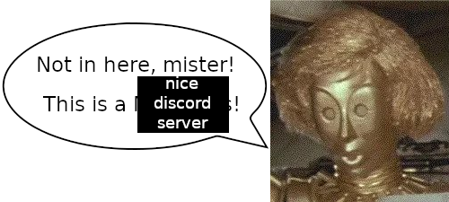

# Dot Matrix



My personal, general-purpose Discord Bot for experimenting/playing around

## Configuration

The following environment variables must be specified, either in the environment itself, or with a `.env` file:

  - `BOT_TOKEN`: The bot token from the corresponding Discord Application
  - `BOT_PREFIX`: An unused prefix for text commands

The following environment variables can be optionally specified, either in the environment itself, or with a `.env` file:

  - `BOT_LOGLEVEL`: The log level for the bot to use, defaults to `INFO`

## Setup

### With Docker

The easiest way to run the bot is using `docker compose up`.

### Locally (without Docker)

The bot is tested with `Python 3.10.6`, so no guarantees outside of that (or inside of that, really)

```console
$ pip install -r requirements.txt
$ python main.py
```
